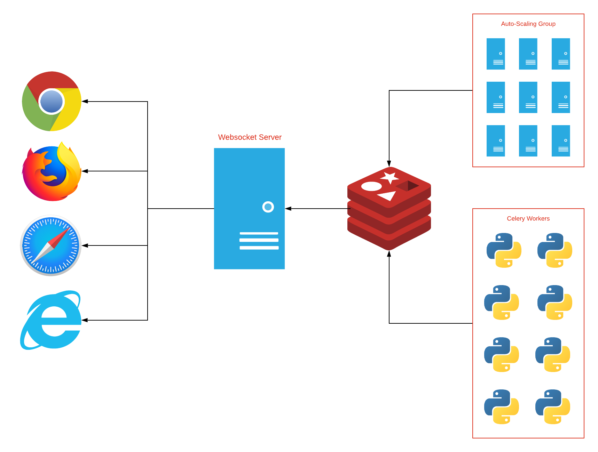
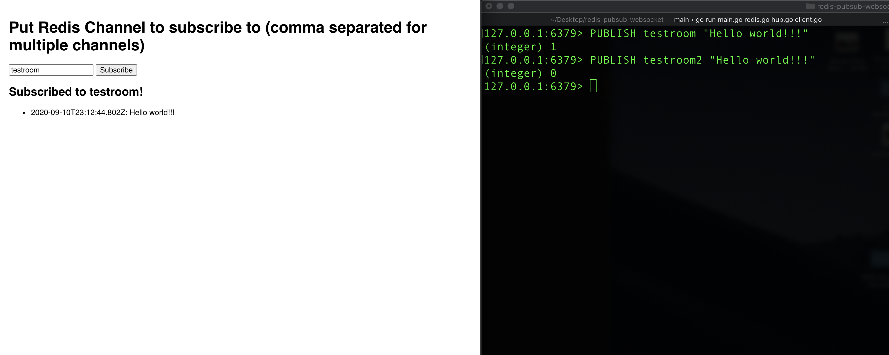

### Infratructure diagram



### Running the websocket server

```bash
$ go run *.go

# or

$ go build .
$ ./redis-pubsub-websocket
```

#### Command line arguments

```bash
$ ./redis-pubsub-websocket --help
Usage of ./redis-pubsub-websocket:
  -debug
      debug mode, stdout results
  -redis string
      redis endpoint (default: redis://127.0.0.1:6379) (default "redis://127.0.0.1:6379")
```

### Connecting to the websocket server with Javascript

```javascript
// specify which "rooms" you want to subscribe to as comma separated URL params
// in your browser console
var ws = new Websocket("ws://localhost:8000/room1,room2,room3");
ws.onmessage = (e) => console.log(e.data);
ws.onclose = (e) => console.log(e);
```

### Testing Websocket server

- Go to `http://localhost:8000`



##### Sending message to Redis PubSub

```bash
$ redis-cli
PUBLISH testroom "hello world room1!!"
```

### Using Docker

##### Building the image

```bash
$ docker build -t redis-pubsub-websocket:latest .
```

##### Running the container

- Use `-redis redis://host.docker.internal:6379` to connect to your local machine's redis server

```bash
$ docker run -p 8000:8000 redis_pubsub_websocket -redis redis://host.docker.internal:6379 -debug
```

##### Using docker-compose

```bash
$ docker-compose up --build
.
.
.
Starting redis-pubsub-websocket_redis_1                    ... done
Recreating redis-pubsub-websocket_redis-pubsub-websocket_1 ... done
Attaching to redis-pubsub-websocket_redis_1, redis-pubsub-websocket_redis-pubsub-websocket_1
redis-pubsub-websocket_1  | 2020/11/29 07:37:58 http server started on :8000
redis_1                   | 1:C 29 Nov 2020 07:37:58.690 # oO0OoO0OoO0Oo Redis is starting oO0OoO0OoO0Oo
redis_1                   | 1:C 29 Nov 2020 07:37:58.690 # Redis version=6.0.9, bits=64, commit=00000000, modified=0, pid=1, just started
redis_1                   | 1:C 29 Nov 2020 07:37:58.690 # Warning: no config file specified, using the default config. In order to specify a config file use redis-server /path/to/redis.conf
redis_1                   | 1:M 29 Nov 2020 07:37:58.695 * Running mode=standalone, port=6379.
redis_1                   | 1:M 29 Nov 2020 07:37:58.695 # WARNING: The TCP backlog setting of 511 cannot be enforced because /proc/sys/net/core/somaxconn is set to the lower value of 128.
redis_1                   | 1:M 29 Nov 2020 07:37:58.695 # Server initialized
redis_1                   | 1:M 29 Nov 2020 07:37:58.696 * Loading RDB produced by version 6.0.9
redis_1                   | 1:M 29 Nov 2020 07:37:58.696 * RDB age 12 seconds
redis_1                   | 1:M 29 Nov 2020 07:37:58.696 * RDB memory usage when created 0.77 Mb
redis_1                   | 1:M 29 Nov 2020 07:37:58.696 * DB loaded from disk: 0.000 seconds
redis_1                   | 1:M 29 Nov 2020 07:37:58.696 * Ready to accept connections
```
